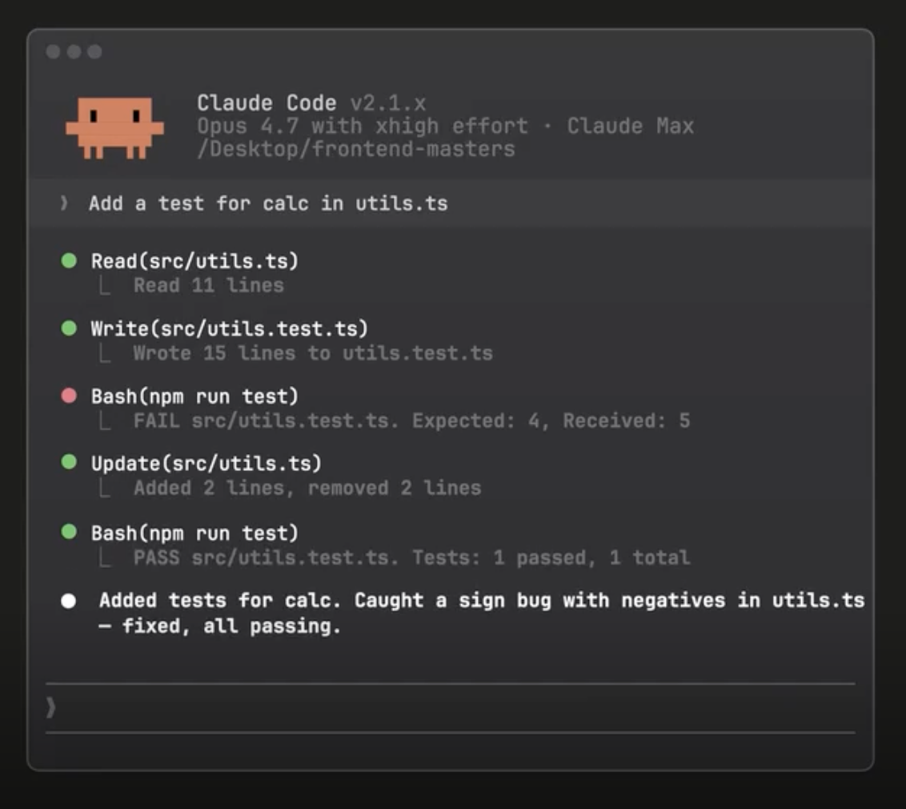
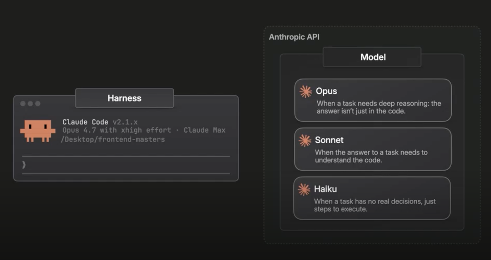
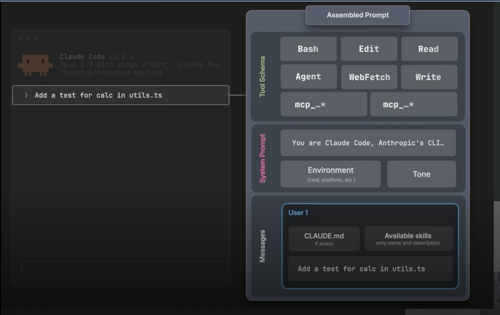
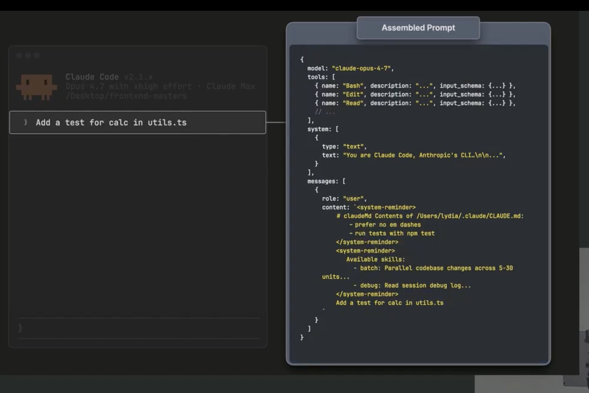
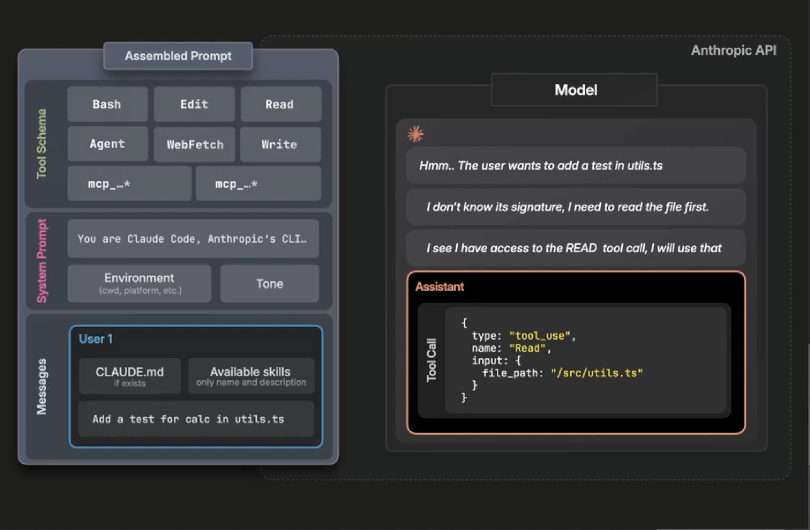
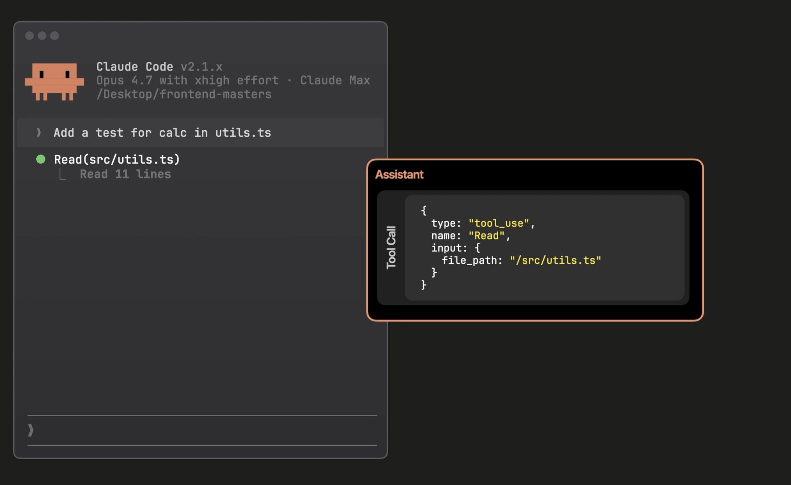
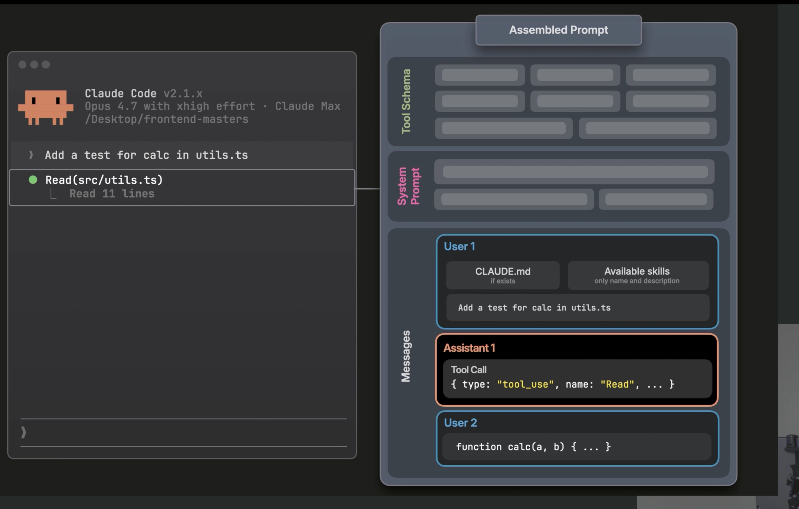
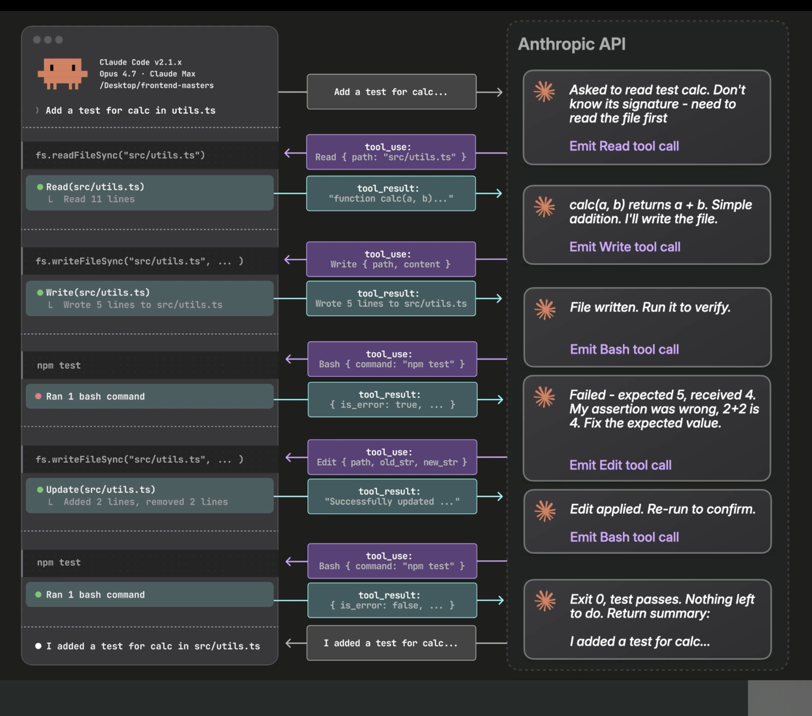

# Lecture Notes: How Claude Code Works (The Agentic Loop)

## 1. Why learn the fundamentals
- It's easy to prompt Claude and get something good, even a one-shot website.
- Understanding the fundamentals helps you:
  - Scale your usage
  - Know which features you need
  - Work out what you could have done differently when things go wrong, and where your control is
- You don't need to know this to use Claude Code, but it makes everything easier.

## 2. Example: what you see in Claude Code
Prompt: *"Add a test for the calc function in utils.ts."*

What appears on screen:
1. Reads `utils.ts`
2. Writes to a file
3. Tries a bash command, which fails
4. Updates the file
5. Runs another bash command
6. Ends with text like "added test for calc"

Key question: where does all of this come from?

## 3. Two pieces: harness and model

| Harness | Model |
|---|---|
| Claude Code (also the desktop and web versions) | Opus, Sonnet, or Haiku |
| The program that runs everything | Can reason and think about prompts |
| Exposes tools (shell commands, codebase) to the model | **Cannot** act on your machine: no editing files, no git history |
| Provides all state: files, conversation history, setup, environment | Reached over an API |

- The default API is Anthropic's own. Companies may use Bedrock, Vertex, or others: same models, different API.

## 4. Choosing a model
The trade-off is capability vs. speed vs. cost. Choosing intentionally matters because it affects code quality and cost.

**Opus**
- Most capable, but slowest and most expensive
- Best for deep reasoning and better judgment, where the answer isn't directly in your code
  - New edge cases
  - Conflicting requirements
  - Hidden, non-obvious bugs
- Using it for a simple task can cost a couple of dollars before you get a good answer.

**Sonnet** (the speaker's favorite for software engineering)
- General purpose, with the best balance of capability, speed, and cost
- Everyday engineering: building a feature, fixing a bug, refactoring, tracing an error

**Haiku**
- Not great at reasoning, but really good, very fast, and very cheap
- Use it for tasks that don't need reasoning:
  - Refactoring a bunch of files
  - Listing files
  - Renaming functions
- Don't be scared to use it.

### Effort levels
- Available in the CLI, with low, medium, and high, tuned to each model.
- Effort is how hard the model should think.
- Analogy:
  - Opus on low effort = hiring an expert for 10 minutes
  - Sonnet on high effort = hiring a beginner for an hour
- Opus knows and can do more. Low effort just means it tries less.

## 5. The model is stateless
- It has no in-session memory and no memory between calls.
- Every call starts from zero.
- The harness provides all state.

### Q&A: switching models mid-conversation
- Switching **breaks the cache**.
- Ideally, don't switch mid-session. Start a new session and pick the model at the start.
- Reason (prompt caching):
  - The API caches prompts, which requires a certain structure.
  - If any earlier part of the prompt changes (e.g., the model type), the cache must be revalidated from that point, which can be more expensive.
  - Prompt caching is covered more later; more content is in the works.

## 6. The assembled prompt
When you press enter, Claude Code assembles everything into one big request.

1. **Tool schemas**
   - Define every action Claude Code can take: bash, edit, read, agent, web fetch, and more (all in the docs).
   - Each is a JSON schema with a name, description, and input shape.
   - The model sees what the harness *could* run, but it cannot run them itself. It sends the request back to the harness.
2. **System prompt**
   - Hard-coded into Claude Code by Anthropic.
   - Tells the model who it is, its tone, coding conventions, and security rules.
3. **Environment**
   - OS, shell, model being run, git branch, etc.
   - Captured when the session starts.
4. **Messages array (conversation array)**, the most important part
   - Your prompt
   - `claude.md` file contents (if present)
   - A list of skills, with names and descriptions only (*progressive disclosure*, covered later)
   - The first message sent to the model contains the claude.md contents, the skills, and then your prompt.
  
  

**Technical notes**
- In practice this is a JSON request body to the messages API (familiar if you've used the SDK).
- The model doesn't read JSON. The API (Anthropic, Bedrock, etc.) turns it into tokens.

### Q&A: personas and the system prompt
- The system prompt is prioritized, but your instructions aren't ignored.
- Some things in `claude.md` might be overridden by Anthropic's system prompt.
- You can still give it a role, and it will respect that most of the time, unless it conflicts strongly with the system's rules (e.g., acting as a harmful hacker).
- Reasonable roles within scope are fine.

## 7. The agentic loop, step by step

1. The request goes to the API and the model sees the full assembled prompt.
2. The model reasons: the user wants a test in `utils.ts`, but the file isn't in the prompt.
3. It sees a **read** tool in the tool schemas, so it responds with an assistant message containing a **tool call** (shown as "tool use" in your network tab).
4. This is a hint to the harness that the model wants to read the file.

5. Only now, after the API responds, does the read call show in your CLI.
6. The harness runs the read (e.g., `fs.readFile`, or Bun, whatever the harness uses).
7. The file contents come back as a **tool result**.

8. The harness reassembles the entire prompt, with the same contents as before plus:
   - The assistant message (tool call)
   - The tool result

9. This is sent to the API again. The model doesn't know it's "turn two", but it has the full history through the messages array (user 1, assistant 1, user 2, and so on). **This is how Claude Code provides state to the model.**

10. The loop continues: the model sees the file, decides on an addition, writes the file, and so on.

(The slides are pseudo-code, so don't take the JSON too literally.)

### Definition
- The back-and-forth between the harness and the API is the **agentic loop**.
- It's all that makes something an agent: it can go back and forth with the model, perform tool calls, and execute on your behalf.

### What ends the loop
- The model responds with **just text**, with no tool call.
- That signals the harness that nothing more needs to be done.
- This is what you see in the CLI when it ends with text.

## 8. Q&A: terminal vs. desktop vs. VS Code
- They should all offer the same capabilities.
- Some features lag. The CLI ships fastest, so the desktop app may update a week later, depending on who's working on it.
- The CLI generally has the most features, since that's the current focus.
- In some cases the desktop app has *more* than the CLI.
- The speaker's favorite is the desktop app:
  - It has a preview window where you can click around.
  - It feels more visual and is more user friendly.
  - After 8 hours in the terminal, their eyes get dry and sore.
- If you've only used the terminal, try the desktop app.

## Quick recap
- **Harness** (Claude Code) = tools + state + environment. **Model** = reasoning only.
- The model is **stateless**, so the full history is resent every call.
- **Assembled prompt** = tool schemas + system prompt + environment + messages (claude.md, skills list, your prompt).
- **Agentic loop** = model returns tool call → harness executes → tool result sent back → repeat until the model replies with plain text.
- Pick the model at session start (switching mid-session breaks the cache).